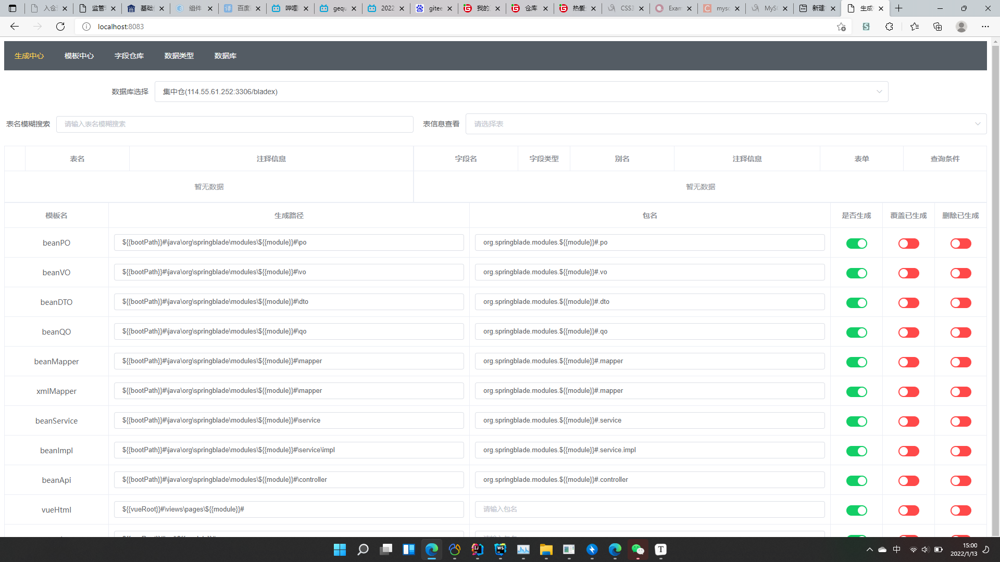
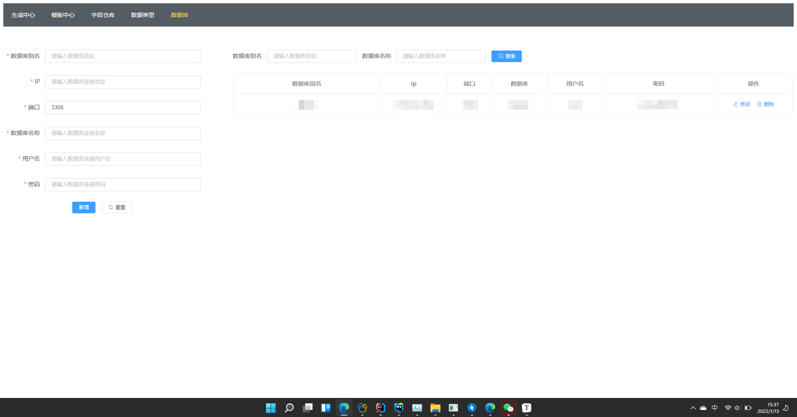
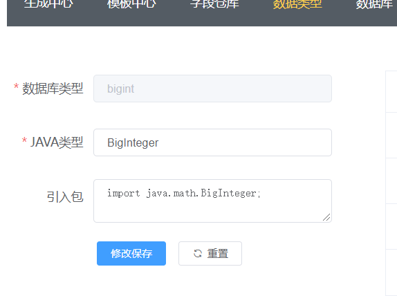
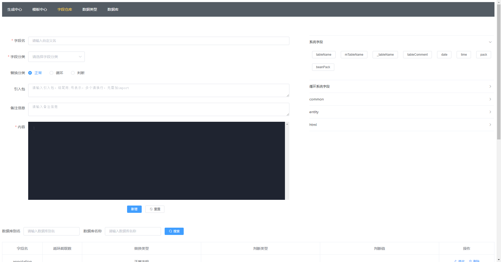
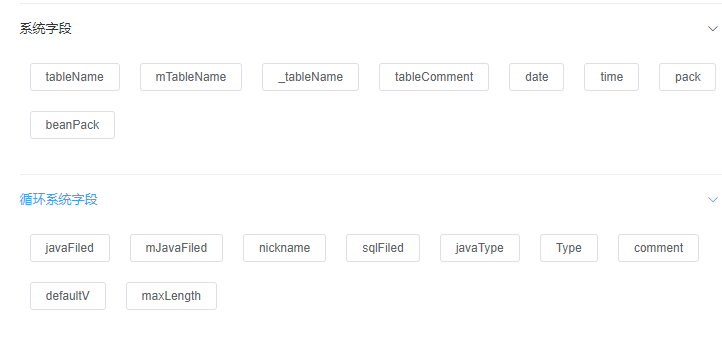
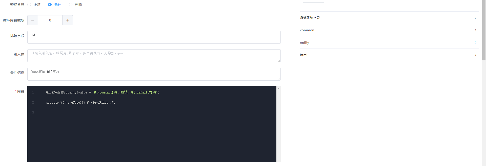
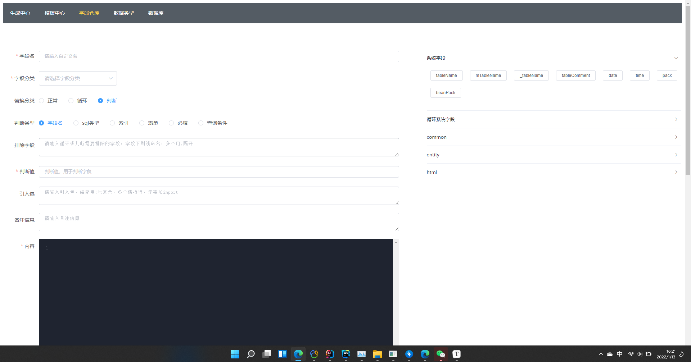
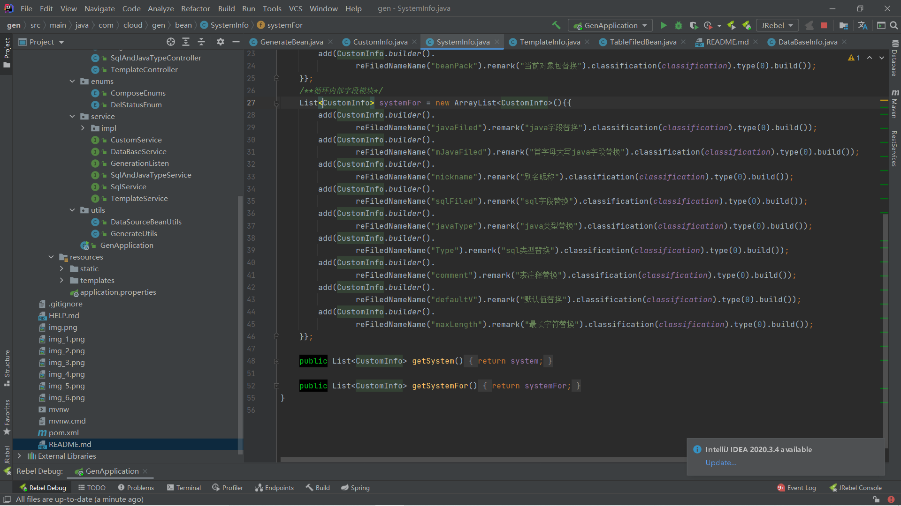
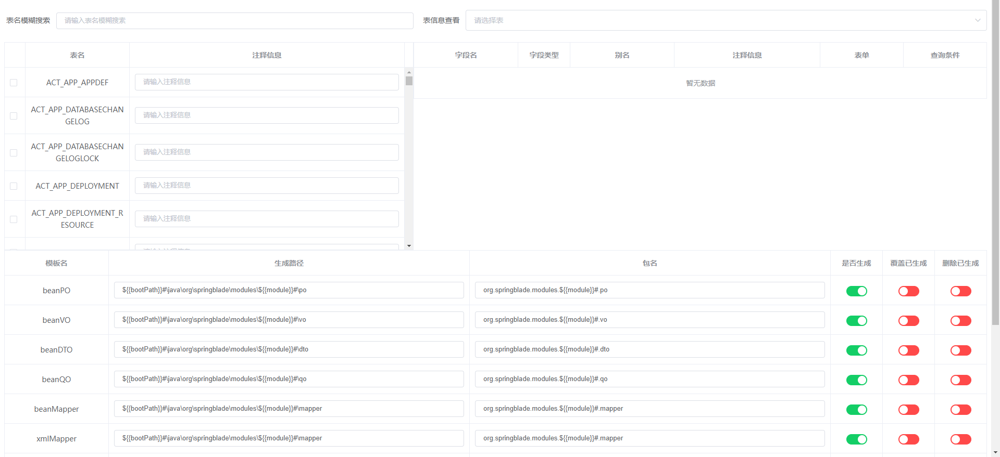

    <h1>灵活的代码生成器</h1>

说明：不同的公司框架结构可能有所不同，前端的框架选型也是各有千秋，为了解决不同区域的不同问题，我运用自己的想法打造了一套简单配置，适应不同框架的代码模板生成器，你只需要配置以下信息

## 一：使用方式

使用git将代码拉到本地启动，然后访问页面，页面分五个部分：生成中心、模板中心、字段仓库、数据类型、数据库

## 二：数据库配置

访问页面，打开数据库菜单一栏，在此处填写以下内容（默认采用的是mysql8的数据库连接，如需其他的请根据源码来进行改造）

**数据库别名：**对该自定义一个名称

**IP：**数据库访问IP地址

**端口：**数据库端口

**数据库名称：**对应数据库名

**用户名：**数据库连接用户名

**密码：**数据库连接密码

## 三：数据库、JAVA实体字段类型匹配

点击数据类型菜单，能看到对应的JAVA与数据库字段类型的对应关系，如果没有在这里配置的话，则默认为String

**数据库类型：**对应mysql数据库的字段类型

**JAVA类型：**对应JAVA的字段类型

**引入包：**JAVA类型需要引入的包，请填写完整的引入包，多个请跨行再写，例如：import java.math.BigInteger;

## 四：自定义字段配置（类似于变量）

字段仓库菜单，在这里我们主要定义我们生成的代码类里面的属性、方法、表单等数据

配置参数有：

**字段名：**类似于变量名，键，用于替换的标识

**字段分类：**用于我们对自定义字段进行分类，可选可输

**替换分类：**可理解为当前自定义字段的类型，大致分为正常自定义字段、根据表字段循环自定义字段、根据表字段判断是否生成自定义字段

**引入包：**当前自定义字段使用需要引入的包，同样填写完整引入包，多个请跨行再写：import java.math.BigInteger;

**备注信息：**解释当前字段的作用，在右边我们可以看到已存在的一些自定义字段，鼠标悬浮上去就能看到对应备注信息，点击就能复制该自定义字段对应的替换字段名（变量名）

**内容：**自定义字段的内容，对应值

**字段名=内容，点击右边的自定义字段就能复制对应字段名（字段名和复制的可能不一致，这是因为防止有些名称重复导致全部替换了，所以采用了一定的配置，比如系统字段tableName的替换字段就是#{{tableName}}#）**

**自定义字段的作用域比较多，它可以在模板中心的文件名上，可以在其他自定义字段的内容中，可以在生成中心生成的路径中，比如我定义${{bootPath}}#代表的就是我项目的所在根路径，${{vueRoot}}#代表的是前端页面的所在根路径**

### 4.1：循环自定义字段讲解

循环自定义字段，实际上就是根据数据库表字段进行循环该自定义字段，比如我们的JAVA实体，就需要选择循环自定义字段，在内容里面填写

​    private #{{javaType}}# #{{javaFiled}}#;

#{{javaType}}#代表对应JAVA类型，#{{javaFiled}}#代表JAVA字段（一般是首字母小写的驼骆峰），而循环自定义字段里面对应的数据库表字段替换变量名，就是在右边循环系统字段里面，而系统字段里面代表的是系统已经定制好的变量值，需要讲解的有

data：当前日期

time：当前时间

pack：引入包（在我们生成类的时候，如果有引入其他类的情况下，是需要引入包的，而pack就是代表替换的包的变量名）

beanPack：当前对应的包名，我们生成实体类的时候是不知道包名的，那么当前类的包名就是用beanPack代替，写法如下

package #{{beanPack}}#;

而其他的变量代表什么大家可以悬浮鼠标进行查看

**排除字段：**我们生成属性名，可能有些公共的实体属性我们不需要生成，那么我们可以在这里进行排除，多个用,隔开，这里填写的字段是数据库字段

**循环内容截取：**我们在循环拼接的时候，可能有时候我们用,隔开字段，那么最后会有一个多余的,，那么我们可以用这种方式进行截取，正数代表前面截取，负数代表后面截取

### 4.2：判断自定义字段讲解

判断自定义字段有五种判断方式：字段名、sql类型、索引、表单、必填、查询条件五类判断方式

上述中我们不难猜到判断自定义其实是根据数据库表字段来进行判断的

而判断自定义字段，就是根据当前循环的数据库表字段来判断是否加载，但他本身并不是循环

**字段名判断：**根据数据库字段名判断，当相等时进行加载

**索引判断：**根据数据库字段索引判断，当相等时进行加载

**sql类型判断：**根据数据库字段类型判断，当相等时进行加载

**表单判断：**根据生成中心对应字段选择的表单来判断，当相等时进行加载

**必填判断：**根据数据库字段判断是否必填，必填时进行加载

**查询条件判断：**根据生成中心旋转的查询条件类型来判断，相等时加载

## 五：模板中心

上面我们讲述了自定义字段，但那是字段的定义，真正生成实体还是依据我们定义的模板来进行生成

模板中心就是定义我们生成实体的模板

**别名：**我们给模板定义的名字

**文件名：**文件生成的名字，可以填入自定义字段

**替换文件名：**对应自定义字段的字段名，不同的是这个键对应的值是文件名，而非内容

**文件后缀：**生成文件的后缀

**备注信息：**该模板的一些备注信息

**内容：**模板的内容

**注意：模板创建后，旁边有一栏叫做模板信息字段，这个对应的是我们生成模板的变量信息，默认的代表文件名，而带上Pack的就是对应类的包名，需要注意的是这个包名不带;和import，而是直接的包名路径**

## 六：生成中心

当信息配置好后，我们可以在此处进行代码生成

**数据库选择：**选择对应的要生成文件的数据库

**数据库表选择：**选择对应的数据库表

**表信息：**对应的是数据库表的字段信息，在这里面我们可以选择对应的生成表单、查询条件，还可以修改注释、别名，别名默认为截取注释的前四位，对应变量名为#{{nickname}}#，这个用来做什么？页面上展示的名称和我们注释是有差异性的，所以采用这种模式

**注：生成模板，输入对应的生成路径，默认情况下，在输入路径后会对路径进行截取，取\java\后面的路径转换为对应的包名，而不论是包名还是路径都可以填写自定义字段名，以此来进行模块区分**

**建议：在生成的时候建议全部生成，防止某些模板没有生成导致引入实体和包信息不全，默认情况下没有选择覆盖已生成就不会覆盖已经存在的文件**

## 七：生成回调

代码生成后，我们需要手动去新增菜单，相对比较麻烦，于是我采用了回调触发的方式，只需要继承GenerationListenDefault类实现configure方法，调用GenerationListenManage的listen方法传入监听函数就能实现

回调参数有：表信息tableBean，生成对应模板信息list
