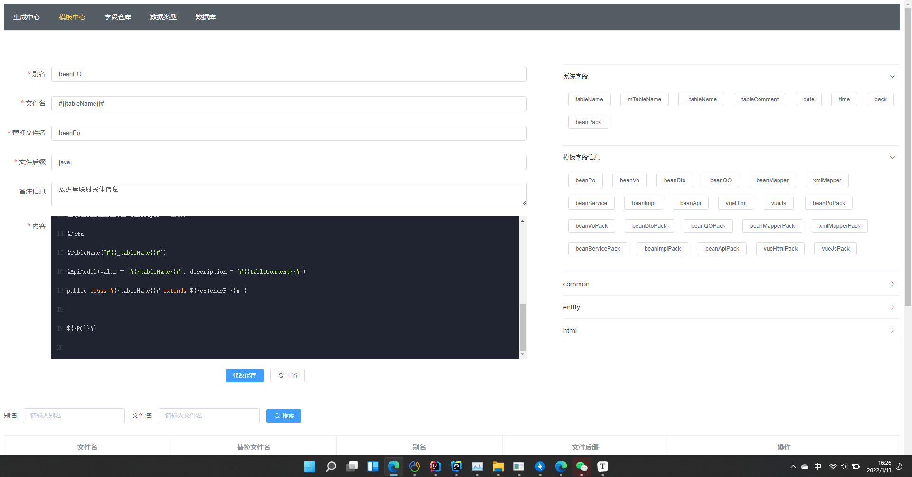

模板代码生成器，一套简单化的程序员代码生成工具，根据用户需要生成自定义模板，此处提供基础的代码生成工具，满足于大部分的框架需要，也可以根据自身需要对模板进行改动
一：数据库连接
提供mysql数据库连接，可以建立不同的数据库获取数据表信息，无需改动代码
填写对应数据库连接信息：
数据库别名：自定义给这个数据库取一个容易识别的名称
IP：连接数据库的IP地址
端口：连接数据库的端口
数据库名称：连接哪个数据库
用户名：连接数据库的用户名
密码：连接数据库的密码
此处只是写了mysql的数据库连接，如果需要加入更多的连接方式，可以在源码里面进行改动适应不同数据库的方式

二：数据类型
代码生成中数据库字段类型和JAVA字段类型是不一致的，所以在数据库类型里面可以自行更改对应的类型，如果没有对应类型则默认String类型

此处可以填入引入包，因为有些类型需要导入不同的包，所以可以在引入包里面进行引入

三：自定义内容
自定义内容------字段仓库
在模板里面我们可以定义我们的模板内容，但是如果内容过多就会导致我们的模板看上去更容易混乱，所以我们可以单独建立一个仓库，用来存放不同的模板内容信息
且这样更加利于我们使用不同的条件来判断是否需要这一段内容

字段名：一般也叫替换名，这里的名字是自定义的，当然写清楚更好，可以是中文名，他的主要左右就是在模板里面可以用这个来代替对应的内容
字段分类：在页面可以看到右边有一排信息--系统字段、循环系统字段等等，这个就是对应的分类，主要用于好快速找到信息，比如bean里面放的就是实体模板的自定义内容
替换分类：这里有三种模式-----正常、循环、判断
    正常：等同于一个常量，在模板或自定义内容里面我们可以直接用这个来代替对应的值，比如模块区分、类注释信息上的创建人名字等信息
    循环：将内容根据表字段数量进行循环添加，每次循环都要将对应的字段信息进行替换（比如字段注释、字段类型、字段名称（sql、首字母大写、骆驼峰三种）、默认值等）
         循环内容循环完成后可能需要截取，循环内容截取就是截取数量，正值截取前面负值截取后面
         排除字段是可能我们不需要全部字段都循环出来，那么这里就可以排除哪些字段不去循环，字段是sql名，多个用,隔开
    判断：这里只针对表字段进行判断，而且每一个判断需要在循环自定义内容里面才生效，比如建立了两个判断体，一个判断用来代表可以模糊查询的数据，一个代表精确查询的数据
         但在模板里面引入我们不能直接引入，需要使用一个循环自定义内容来将这两个自定义判断放进去，然后将这个循环自定义放入模板即可
引入包：这个自定义内容需要引入的包
备注信息：在右边那一块按钮，悬浮就能显示对应备注信息
内容：填写自定义内容，如果需要对应的替代信息，直接点击右边按钮就能将这个替代名复制下来，在内容里面直接粘贴即可
四：模板中心
这里是不同的模板，如实体模板，xml模板，前端模板，service模板等
别名：自定义名称（主要是可以看的）
文件名：这个文件的名称，同时也是类名，可以填写自定义内容（字段仓库）
替换文件名：使用这个可以替换文件名，还能引入对应的包
文件后缀：对应的这个文件后缀名
备注信息：用于自己的注释
内容：填写模板内容

五：生成中心
选择数据库：
选择需要生成的对应表：
可以更改对应表的字段内容信息
随后下面是对应模板的内容，默认生成，如果选择删除已生成，则会默认直接删除生成的模板，优先级最高

